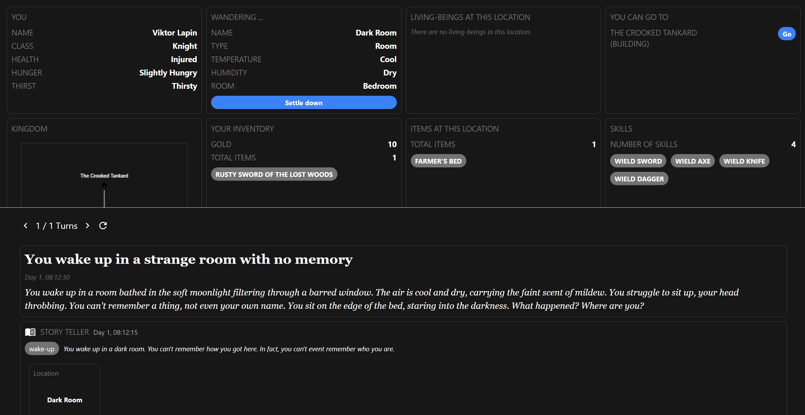

# 🍻 The Crooked Tankard

⚠️ **This repository contains source code of our hackathon submission for the [Google Chrome Built-in AI Challenge](https://googlechromeai.devpost.com/).** ⚠️

⚠️ **Since the submission, the repository content may have modified. [Go back to revision 7ee9322d](https://github.com/SIOCODE-Open/chrome-built-in-ai-apps/commit/7ee9322dc99974a29939bf374802fb3a52cd27af) to see the state of the repository at the time of the submission.** ⚠️


The Crooked Tankard is a _text-based role playing game_. It is powered by _web technologies_, specifically _built-in AI_ and _React_. The AI generates narration, items, and many more to create _infinite replayability_ and a _vast random world_.



▶️ [Watch our video of the game](https://youtu.be/WRLDsdM7CpU)

🎮 [Play the game here](https://crookedtankard.com)

📖 [Learn about the game](./docs/USERGUIDE.md)

📖 [See how the game works](./docs/INTERNALS.md)

## Building

To build the project, you need to have [Node.js](https://nodejs.org) installed.

The project is an _NPM mono-repo_, and it contains two single page application projects: [`app-brainstorm`](./packages/app-brainstorm/package.json) and [`app-game`](./packages/app-game/package.json). **We only care about the `app-game` project, and `app-brainstorm` will be removed in the future.**

We use **NPM** to manage the dependencies of the project. Run the following commands to install the dependencies of the project.

```bash
npm install
```

After the dependencies are installed, you can build the project by running the following command.

```bash
npm run build:game
```

To serve the game locally on port `3200`, you can run the following command.

```bash
npm run serve:game
```

After that, open [http://localhost:3200](http://localhost:3200) in your browser to play the game.

# Licenses

All source code in this repository in licensed under the MIT license.

[ProJor](https://projor.io) is licensed under the [ProJor Licenses](https://license.projor.io).
