# The Crooked Tankard - User Guide

> ***So you want to know how to play the game?***
> 
> You are in the right place!
> 
> This is a complex make, similar to _Dungeons and Dragons_ and other _role playing games_. On this page, we help you get started in the world of _The Crooked Tankard_.

# Step Zero

**This game uses experimental AI technology.** You read that right, the game depends on the so-called _Prompt API_, which is currently only built into [Google Chrome](https://www.google.com/chrome/).

To be able to [play the game here](https://crooked-tankard.siocode.hu), you need to first _set up Google Chrome Canary_, and _enable the necessary experimental flags_. **These are the steps you need to take:**

* Sign up for [Google Chrome Built-in AI - Early Preview Program](https://docs.google.com/forms/d/e/1FAIpQLSfZXeiwj9KO9jMctffHPym88ln12xNWCrVkMY_u06WfSTulQg/viewform)
* Install [Google Chrome Canary](https://www.google.com/chrome/canary/).
* Open the browser, and go to `chrome://flags`.
    * Enable `Prompt API for Gemini Nano`.
    * Set `Enables optimization guide on device` to `EnableBypassPerfRequirement`.

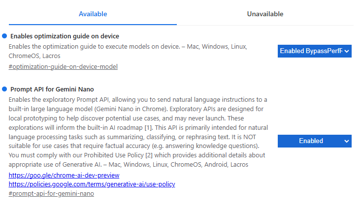

* Restart the browser.
* Now go to `chrome://components`
    * Click `Update` for **all components**.
    * Make sure this component appears: `Optimization Guide On Device Model`.

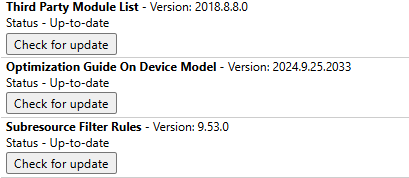

* _You might need to wait 24 hours before you are able to play the game._

# The very beginnings

Before beginning your journey, you must fill out the _Character Creation Screen_. The game will generate you a name, but you can change it if you want. You can also choose your _character class_.

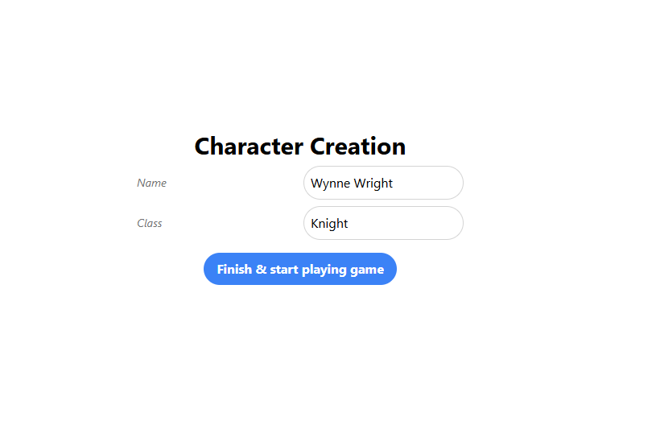

Your **class** is important, because it defines for example the _types of weapons you can wield_.

* **Knights** can wield _swords_, _axes_, _knives_ and _daggers_.
* **Archers** can wield _bows_, _crossbows_, _knives_ and _daggers_.
* **Mages** can wield _staffs_, _knives_ and _daggers_.

At the beginning of the game, you _wake up in a dark room_, and _cannot remember how you got here, or who you are_. You are _completely free to explore the world_, and _do whatever you want_ - that is, given the game knows how to handle what you want to do.

The game screen is divided into two sections:

* On the **top**, you can see the **Info Views**. These boxes give you a sense of your _current situation_. One box for example shows your _health_, _hunger_ and _thirst_ values, while another _allows you to travel to different locations_.
* On the **bottom**, you can see the **Game Feed**. Each action you take is recorded in the _game history_, and your actions cause a _series of events to occur_. In the game feed, you can see each event that occured in the game turns. You can also see the narration, and headline for that given turn. This is **past data**, and you can _scroll back_ to see what happened in the past.

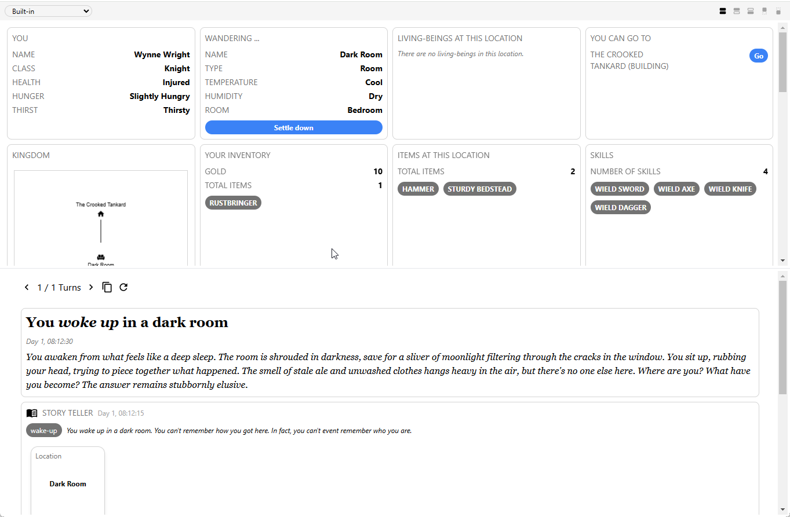

# Take a look around

It is your first turn, and nothing has happened yet. You should look at the box titled **You**, which shows, that:

* You are **injured**,
* You are **slightly hungry**,
* You are **thirsty**.

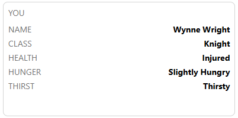

You can also see in the **Wandering...** box, that you are currently in a room. This box also shows you the _temperature_ and _humidity_ of your current location.

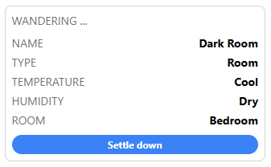

Hovering over things in this game reveals detailed information about them. You can hover over _items_ to see their details. You can also hover over _temperature_ or _humidity_, to read the _description_ of them. **Hover around all little UI elements with the mouse on the screen to get a sense of what information you can find.**

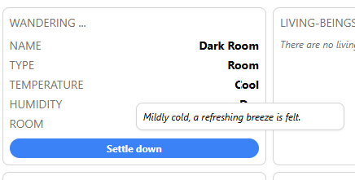

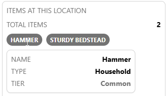

There is also the **Items at this location** box, which shows you the items you can find in the room. In bedrooms it's common to have _beds_, but your starting location may also contain _chests_, _lockers_ or small _household items_. You can _click any of these items_ to reveal the actions you can do with them. This is how you _pick up_, _equip / unequip_, _consume_ or _eat_ items as well by the way.

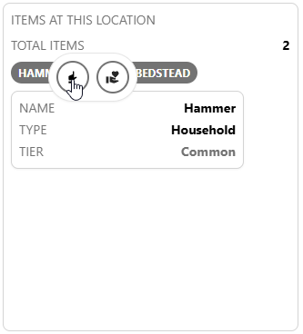

You may have noticed the **Your inventory** box as well: this shows what your character is _currently bringing_ with themselves, and also _how much gold you have_. You should be able to _sell_ anything for gold, but also _buy_ anything as well. Clicking on the items in your inventory will show you the actions you can do with them.

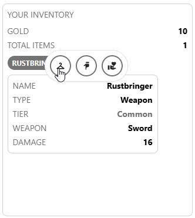

# Going out of the room

If you look at the **You can go to** box, you will notice that there is a single destination you can go to, **The Crooked Tankard**. Click the **Go** button to move to a different location.

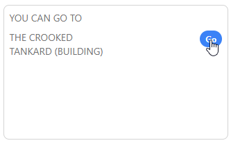

After some loading screen (20-60 seconds typically), you will arrive at the **The Crooked Tankard**.

There should be different items in the **Items at this location** box, but you should also give some attention to the **Living-beings at this location** box. This is where you can find NPCs, or Non-Player Characters. Some are friendly (blue box), some do not care about you (gray box), and some are hostile (red box). You can _talk_ to them, _trade_ with them, or _attack_ them.

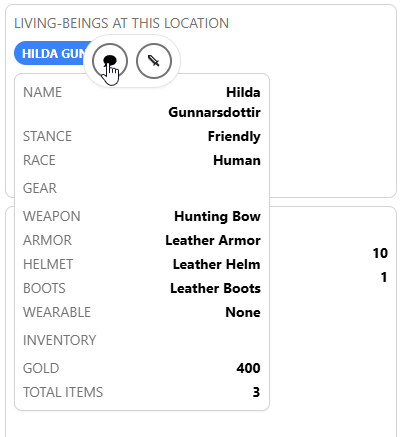

# Eating and drinking

In the game, as time passes you get _hungry_ and _thirsty_. If you don't eat or drink for a long time, you will _die_.

Fortunatelly, the tavern is _filled_ with food and drinks. They are common in _cellars_ and _storage rooms_, but you can also find some lying around in the _tavern building_ as well.

Click on a _Food_ item, and select the _meat_ icon to eat it. Click on a _Drink_ item, and select the _cup_ icon to drink it.

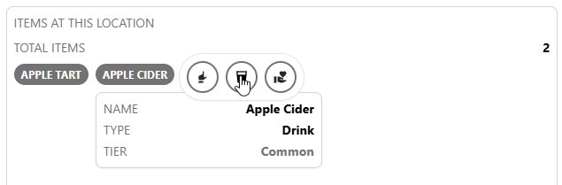

# Your gear

If you look in you inventory, you should be able to see, that you have some basic starting _weapon_. Click on it, and select the _cloth hanger_ icon to equip it.

There's also the **Gear** box, which shows what gear you _currently_ have equiped. You can also _unequip_ these items, by clicking on them, and selecting the _down arrow_ icon.

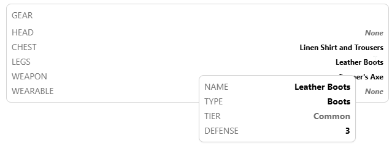

# You health

At the beginning of the game, you have _40_ out of max _100_ health points. This makes your _health status **injured**_. If you _lose all your health points_, you will _die_.

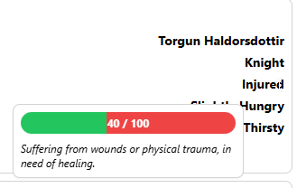

You can find or craft _consumables_, that heal you. You can also find wearable items, that heal you when attacking or defending, but this is not available right at the beginning of the game.

You should be able to find a _pharmacy_, or _alchemist's guild_ in the village. You can _trade_ with NPCs here to acquire _healing potions_, which can then be consumed by _clicking_ on them, and selecting the _hand with a hard_ icon. This action icon is also used to consume _other consumables_, such as _explosives_ or _scrolls_.
